

<h1 align='center'>Meta Human Hub</h1>

[View the live project here.](https://meta-human-hub.herokuapp.com/)

This is the main marketing blog for Meta Human Hub. It is designed to be a platform for the site owner to display posts and advertise their skills online. It has user interaction on posts so that comments can be made by the user to talk about the fitness tip posts or request a future fitness tip. It also has a booking and enquiry section for users to arrange sessions with the trainer. 

<h2 align='center'>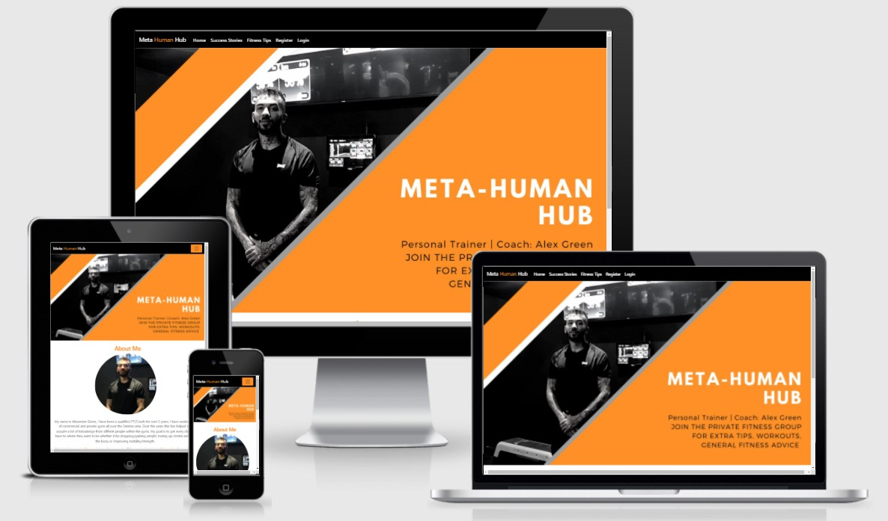</h2>

## User Experience (UX)

### User Stories
#### 1. As a user, I would like to be able to...

- 1.1 View the about me page so that I understand what the blog is about.
- 1.2 View a list of posts so I can select one to view.
- 1.3 Click on a post so I can see the full content within it.
- 1.4 Register an account so that I can see posts and comment on posts.
- 1.5 View comments on an individual post so that I can read the conversation.
- 1.6 Comment on post so I can be involved in the conversation.

#### 2. As site admin, I would like to be able to...

- 2.1 Create, read, update and delet posts so that I can manage my blog content.
- 2.2 Create draft posts so that I can finish making the content later.
- 2.3 Approve of disapprove comments so that I can filter out the objectionable comments.
- 2.4 Comment on posts so I can be Involved in the conversation. 

### Strategy
### Project Goals

Create a platform that allows the Trainer (admin) to advertise their skills to people (users) allowing them to view the Trainers content on fitness tips, success stories and history of the Trainer. Also allow the Trainer to interact with the users to gain potential clients. 

### Scope

- A simple, straightforward, intuitive UX experience;
- An explicit content;
- An easy navigation for the user through all the features;
- A site that is visually appealing on most devices.

## Functional Scope
### Meta Human Hub Flowchart

    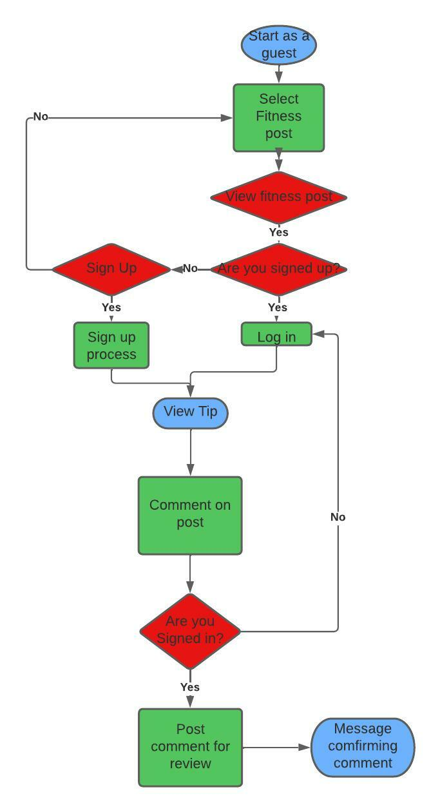

### Entitiy Relationship Diagram 

    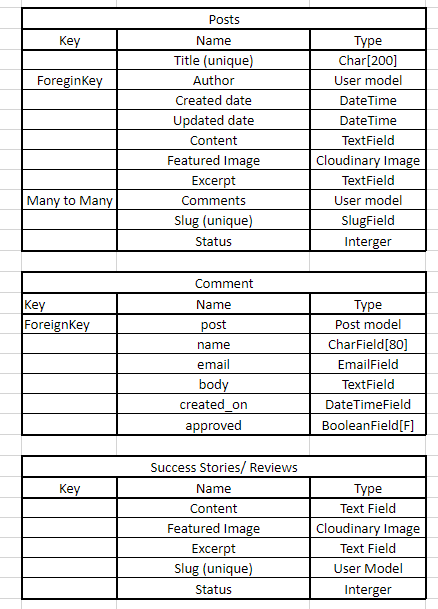

## Structure

- A clear and straightforward layout is in place to ensure users can navigate intuitively and have a leisurely experience.
- Navbar is fixed on top to facilitate users to navigate through pages easily. Small navigation is the same on all pages to ensure easy navigation.
- Comments are straightforward forms to allow the users to use the feature without issues. 
- Easy to find social media links to allow the user to find out more about the Trainer. 

## Skeleton

### Wireframes
#### Home page

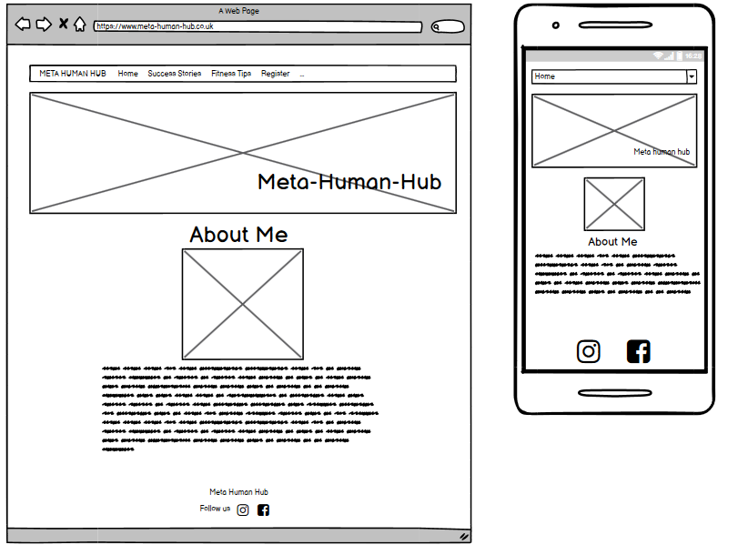

#### Success Stories page

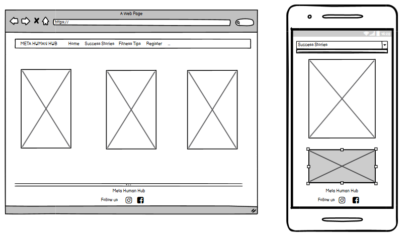

#### Fitness tips page

<im src="media/fitness-tips.jpg">

#### Post views page

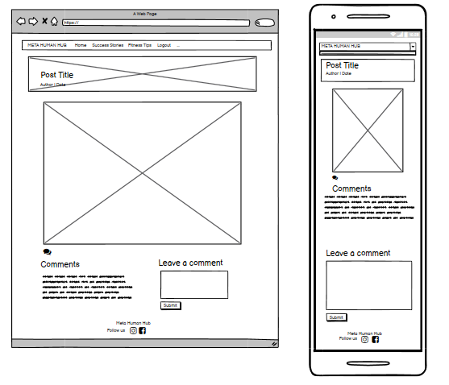

#### Register page

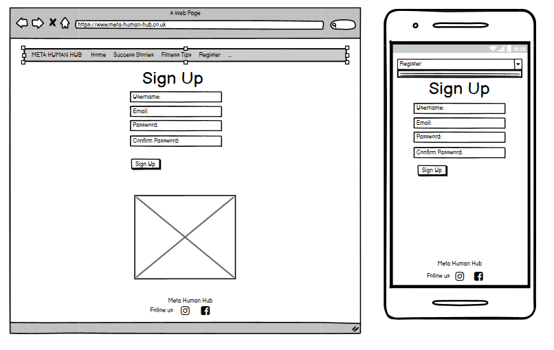

## Surface
### Colours
The colours used were selected by the Trainer Alex Green as part of his branding image.

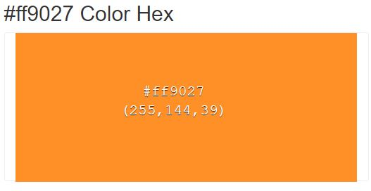 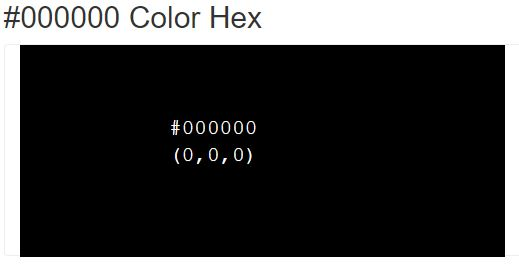

Colour was found using [HTML Colors Codes](https://html-color-codes.info/colors-from-image/). To take the colour from the banner used on the Home page. 

### Font
Two complimentary fonts were chosen with [Google Fonts](https://fonts.google.com/)

The chosen fonts were Roboto for Headings and navbar and Lato for comments and paragraphs.

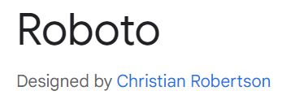 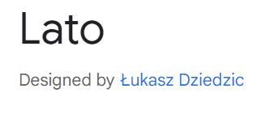

## Existing Features

## Future Features

- An online booking system so logged in users can arrange time with the trainer.
- A contact form so potential future clients can get in touch.

## Languages Used
- Python 3.0
- HTML
- CSS

## Frameworks, Libraries and Programs Used
- Balsamiq: Balsamiq was used to create the wireframes during the design process.
- Font Awesome: Font Awesome was used on all pages to add icons for aesthetic and UX purposes.
- Git: Git was used for version control by utilizing the Gitpod terminal to commit to Git and Push to GitHub.
- GitHub: GitHub is used to store the project's code after being pushed from Git.
- Google Fonts: Google fonts are used to add fonts for aesthetic and UX purposes.
- Django: Framework used to add structure to the platform.
- Summernote: A WYSIWYG editor for posts.
- Cloudinary: Used to manage to images and videos for the posts. 
- bootstrap: Used to assist with the responsivness and styling of the website.

## Testing

### I have manually tested the project by doing the following
- Tested python code through [PEP8](http://pep8online.com/) linter.
    - settings.py file showed up errors.
    - The four too long line errors found on settings were related to links from Cloudinary and Auth Password Validators
    - All other py filed showed no errors.
    

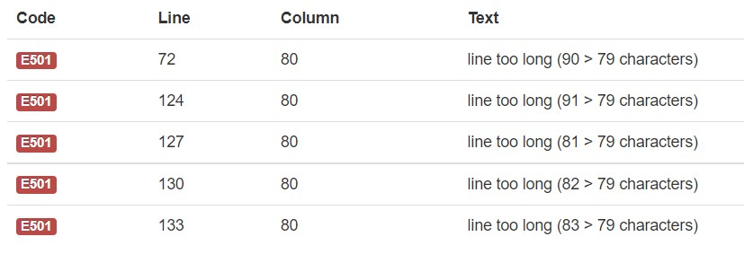

- Tested CSS code through [W3C](https://jigsaw.w3.org/css-validator/) vailidator witrh no errors found.
- Tested HTML code through [w3C](https://validator.w3.org/) validator 

### Testing User Stories from UX
#### 1. As a user, I would like to be able to...

- 1.1 View the about me page so that I understand what the blog is about.
    - Upon entering the site users are greeted with the banner image which gives the user a clear indication of what the site is about then you scroll down to the about me section which fully outlines the sites intentions.
- 1.2 View a list of posts so I can select one to view.
    - On the two pages of posts first being success stories and second being fitness tips the user can view 6 posts per page which enables them to select one to view.
- 1.3 Click on a post so I can see the full content within it.
    - When a user clicks on the title of a post it then takes you to the full post view so you can see the content to the post.
- 1.4 Register an account so that I can see posts and comment on posts.
    - The posts are only viewable to users that are signed up to the site. The registration process is easy to follow and there are links used on the home page, in the nav bar and when the user clicks on a post it asks you to register.
- 1.5 View comments on an individual post so that I can read the conversation.
    - Comments can be viewed on the posts once a user is signed up to see the posts. 
- 1.6 Comment on post so I can be involved in the conversation.
    - Registered users can leave comments on post. 

#### 2. As site admin, I would like to be able to...

- 2.1 Create, read, update and delete posts so that I can manage my blog content.
    - As a created Superuser post can be created, read, updated and deleted. This can all be done from the django admin panel.
- 2.2 Create draft posts so that I can finish making the content later.
    - Post can be set to not published so the superuser can come back to it at another time. 
- 2.3 Approve of disapprove comments so that I can filter out the objectionable comments.
    - Comment have to be approved by admin or superuser before they are posted to be viewed on the site. 
- 2.4 Comment on posts so I can be Involved in the conversation. 
    - Superuser can also comment on posts to be involved in the conversation. 

### Further testing 

- The website was tested on Google Chrome, Microsoft Edge and Safari browsers.
- The website was viewed on a variety of devices such as desktop, laptop, Android phones, iPhones and Andriod tablets. 
- A large amount of testing was done to ensure that all pages were linking correctly.
- Friend, Family and Peers were asked to review the site and point out any bugs and/or user experience issues. 

## Project Bugs and Solutions

1. Database error - This error happened after Heroku did maintenace on the database which resulted in me having to change the database url in the env.py file.
2. 'choices' must be iterable containing tuples - missed () around 1, 'published' on line 5 in models.py file. Once added error cleared.
3. Banner image would not load - Tried to use a locally stored image for the banner but it would not load. Uploaded banner through cloudinary and it works fine now. 
4. CSRF verification failed - Fixed this error by adidng CSRF_TRUSTED_ORIGINS = ['https://8000-ak2489-metahumanhub2-zojhsvdjdqk.ws-us38.gitpod.io'] in the setting.py file. 
5. CSS file not loading at deployment - Typos in the settings.py line 155 STATISFILES_STORAGE was missing the S on files. 

## Deployment

This App is deployed using Heroku.

#### Heroku depolyment steps
- Fork or clone this repository.
- requirements.txt can be left empty as this project does not use any external libraries.
- Create a new app in Heroku.
- Select "New" and "Create new app".
- Name the new app and click "Create new app".
- In "Settings", click "Reveal Config Vars" and input the folloing.
    - CLOUDINARY_URL
    - DATABASE_URL
    - SECRET_KEY
- Click on "Deploy" and select your deploy method and repository.
- Click "Connect" on selected repository
- Click "Deploy Branch" in the manual deploy section.
-Heroku will now deploy the App.

# Credits

## Media
- All media used by this site is owned by Alex Green as part of his branding for [Meta Human Hub](https://www.instagram.com/metahumanfitness92/)

## Work based on other code
- Some code taken from Code Institue [I think before I blog](https://learn.codeinstitute.net/courses/course-v1:CodeInstitute+FST101+2021_T1/courseware/b31493372e764469823578613d11036b/fe4299adcd6743328183aab4e7ec5d13/) code along project.
- Testing assitance used from YouTube channel [The Dumbfounds](https://www.youtube.com/channel/UC33uwXXDrI5TxG4IXnjS28g).

## Acknowledgements
- Special thank you to go out to Narender Singh whos patience, understanding and explaining helped me finish this project. 
- Thank you to Scott(with the Killua avatar) one of the Code Insititue tutors who always seemed to come to my aid when asking for tutor assistance. 
- Thank you to Ed one of the Code Institute tutors who helped me find the typo in my code that was not letting my deployed app find me CSS file.
- Thank you to my Wife Heather who has let me get away with doing no house work what so ever to help complete this project.